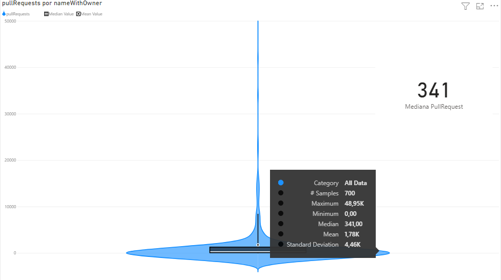
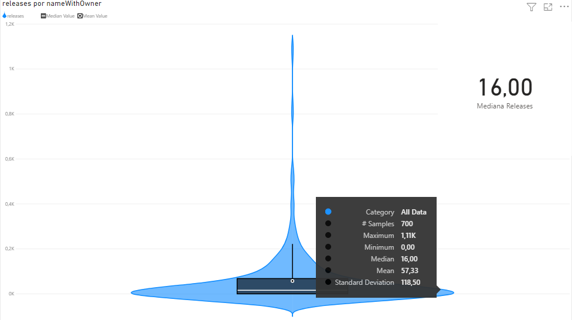
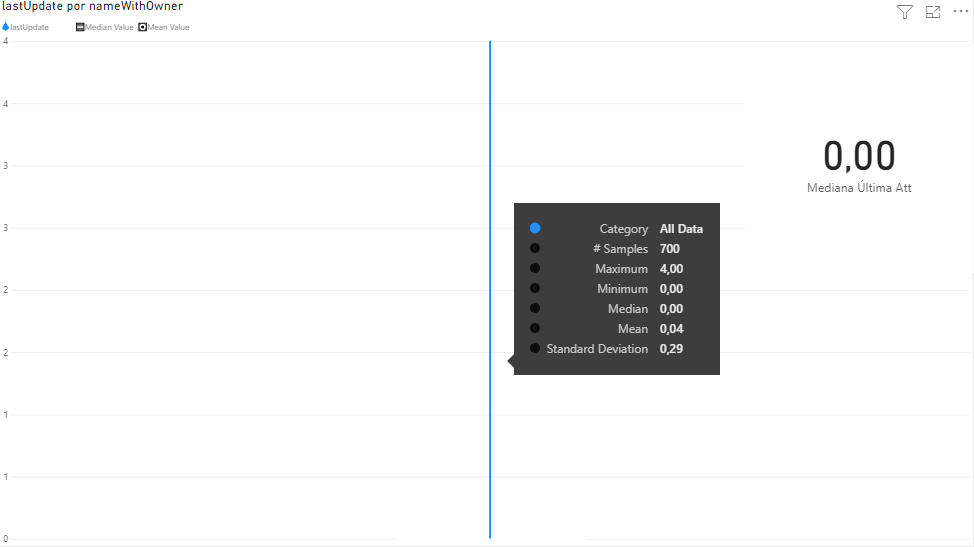
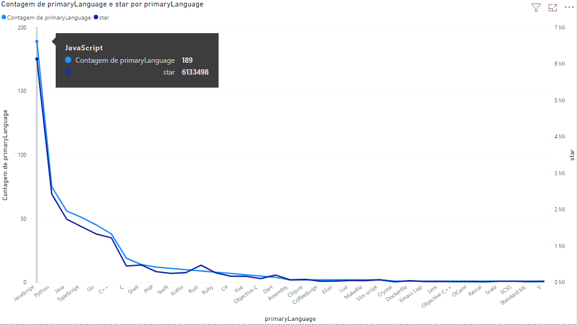
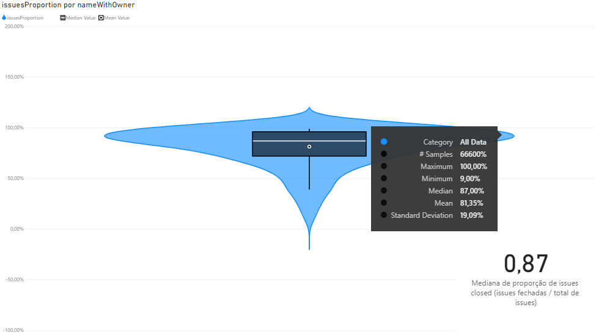
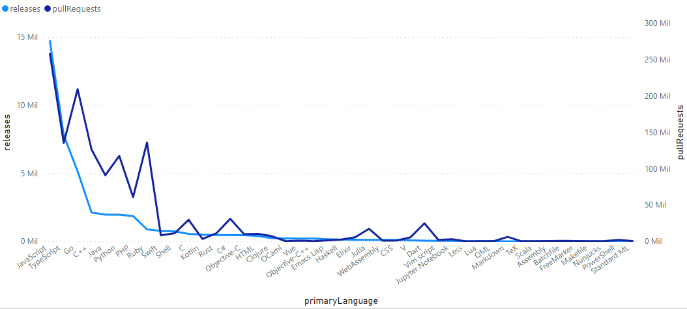

# Relatório

## Autores

**Arthur Rocha Amaral**

**Guilherme Oliveira Antônio**

---

## Introdução

Este trabalho tem o intuito de estudar os repositórios populares do GitHub. Dessa maneira, sera analisado o desenvolcimento, frequência de contrubuição externa, frequência de lançamento de release, popularidade, tempo de exixtencia do repoditório, linguagem primaria usadas e total de issues fechadas. Com o intuito de atingir o objetivo de encontrar os projetos populares, sera buscado os 1000 repositorios com mais estrelas. Assim, como mecanismo de busca de dados necessários para análise sera usado o mecanismo de busca do GitHub com Graphql.

---

## Metodologia

Para obtermos os dados a serem avaliados, buscamos da API GraphQL do GithHub os repositórios ordenados decerescentemente pela quantidade de estelas, listados em páginas de 100 items, assim, pegaremos as 10 primeiras páginas com os dados necessários para respondermos as questões de pesquisa. Após o recebimento dos dados, filtramos os dados inconsistentes e salvamos o resultado em um arquivo CSV como feito na sprint 2 desse projeto.

Após dados filtrados, mapeados e armazenados, utilizamos esses para criar os gráficos que ilustram os valor obtidos e com os quais chegaremos as respostas.

---

## Discussão/Hipoteses/Valores obtidos

- RQ Q1 - Sistemas populares são maduros/antigos?

  - **Hipótese**: Os repotitórios com mais estrelas tendem a ter mais de 4 anos de existência.
  - **Metodologia**: Para a análise desse requisito, a idéia é verificar a quantidade de tempo desde que o projeto foi criado, assim sera obtido qual é a mediana da idade dos repositórios.
  - **Resultados**: Foi verificado que entre os 1000 repositórios mais populares, a mediana das idades apontam para 6,44 anos desde da criação do repositório.

    

  - **Discussão sobre o que era esperado e o resultado obitido**: A hipótese consistia em que os repositórios mas populares tivessem em torno de somente 4 anos de exitência, e após analise dos resultados, é capaz de perceber que os repositórios com mais estrelas no GitHub tendem a ter 6 anos e 5 meses, uma idade consideravelmente longa para um projeto. Por tanto, consta que os projetos mais populares são sim projetos relativamente velhos.

- RQ Q2 - Sistemas populares recebem muita contribuição externa?

  - **Hipótese**: Repositórios populares tendem a ter valor de mediano de 1000 pull requestes.
  - **Metodologia**: Para análise desse requisito, a idéia é verificar a quantidade de Pull Requests feitos pela comunidade, afim de saber qual o valor mediano de quantidades de Pull Requestes completados, assim saberemos como é a contribuição nos projetos populares.
  - **Resultados**: O resultado obtido foi que entre os repositórios populares o valor mediano de pull requestes é de 341 PRs, indo de repositórios com 0 Pull Requests até repositórios com 48953 PRs.

    

  - **Discussão sobre o que era esperado e o resultado obitido**: O reultado obitido mostra que e os repositórios recebem um valor considerávelmente baixo de contribuições. Ainda mais comparando com o dado da Q1, a idade desses repositórios é muito alta para somente essa quantidade de PRs.

- RQ Q3 - Sistemas populares lançam releases com frequência?

  - **Hipótese**: Repositórios populares tendem a lançar em media 100 Releases durante seu tempo de vida.
  - **Metodologia**: Para análise desse requisito, a idéia é verificar a quantidade de Releases feitas, assim conhecendo como é a frenquência de novas versões nos projetos populares.
  - **Resultados**: O resultado obtido foi que entre os repositórios populares o valor mediano de Releases é 16, indo de repositórios com 0 à repositórios com 1115 PRs.

    

  - **Discussão sobre o que era esperado e o resultado obitido**: Como obeservado no resultado, os repositórios populares de tem uma frequência mediana de 16 releases no seu tempo de vida. Porém, deve se considerar a grande quantidade de projetos que não tem releases lançadas, isso afeta diretamente o dados a ser analisado. Assim, pode se considerar esse requito de análise fraco/falho, pois os projetos com 0 releases podem ter seus versionamento diferente do que é previsto pelo GitHub.

- RQ Q4 - Sistemas populares são atualizados com frequência?

  - **Hipótese**: Repositórios populares tendem a ficar sem atualização durante 5 dias.
  - **Metodologia**: Para análise desse requisito, a idéia é verificar a quantidade de dias desde a última atualização de cada repositório, assim conhecendo como é a frenquência de atualização dos projetos populares.
  - **Resultados**: O resultado obtido mostra que entre os repositórios populares o valor mediano de dias desde a última alteração é de 0 dias, indo de repositórios com 0 à repositórios com 4 dias desde a última atualização.

    

  - **Discussão sobre o que era esperado e o resultado obitido**: Com o resultado obitdo é possível perceber que os repositórios populares são atualizados diariamente em sua grande maioria, poucos repositórios tiveram mais de 1 dia desde sua última avaliação.

- RQ Q5 - Sistemas populares são escritos nas linguagens mais populares?

  - **Hipótese**: Agrupando os repositórios pelas suas linguagens primárias e observando o total de estrelas, as 10 linguangens definidas pelo OctoVerse 2021 como as linguagens mais populares, estaram entre as 10 linguagens com mais estrelas entre os repositórios mais populares do GitHub.
  - **Metodologia**: Para análise desse requisito, a idéia é verificar as linguagens primárias dos projetos populares, assim fazendo um comparação com as linguagens mais populares indicadas no OctoVerse 2021.
  - **Resultados**: Na comparação dos repositórios mais pipulares e as linguagens mais populares, foi encontrado 7 de 10 lingugens. Dessa forma pode se dizer que os repositórios populares estão utilizando as linguagens mais famosas do GitHub.

  javaScript; python; java; typeScript; go; C++; C; shell; Php; Swift

    

  - **Discussão sobre o que era esperado e o resultado obitido**: Era esperado que entre os repositórios mais populares tivessem as linguagens: [JavaScript, Python, Java, TypeScript, C#, PHP, C++, C, Shell, Ruby] mas o resultado encontrado mostrou estar bem alinhado com o esperado, somente que algumas linguagens apesar de serem muito usadas em outros repositórios, não são utilizadas na mesma proporção entre os repositórios mais populares. Podemos também interretar que algumas linguagens favoritas da comunidade, não são necessariamente linguagens usadas por grandes projetos.

- RQ Q6 - Sistemas populares possuem um alto percentual de issues fechadas?

  - **Hipótese**: 
  - **Metodologia**: 
  - **Resultados**: 

    

  - **Discussão sobre o que era esperado e o resultado obitido**:

- RQ Q7 - Sistemas escritos em linguagens mais populares recebem mais contribuição externa, lançam mais releases e são atualizados com mais frequência?

  - **Hipótese**: 
  - **Metodologia**: 
  - **Resultados**: 

    

  - **Discussão sobre o que era esperado e o resultado obitido**:
