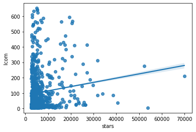
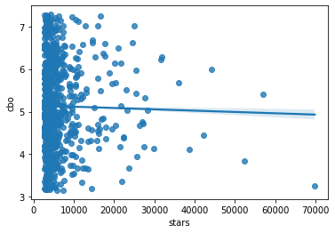
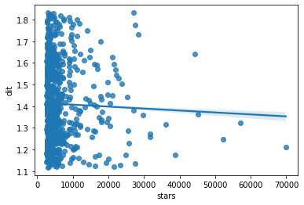
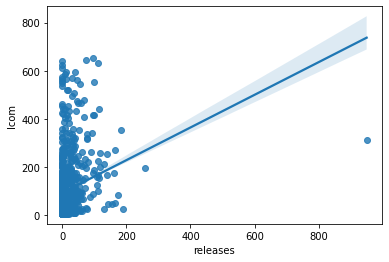
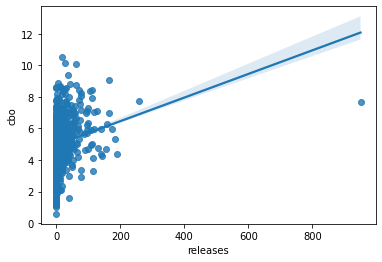
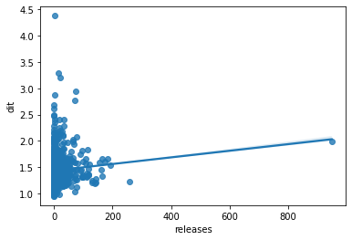

# Relatório

## Autores

**Arthur Rocha Amaral**

**Guilherme Oliveira Antônio**

---

## Introdução

Este trabalho tem o intuito de estudar os repositórios populares do GitHub. Dessa maneira, sera analisado o desenvolvimento, frequência de contribuição externa, frequência de lançamento de release, popularidade, tempo de existência do repositório, linguagem primaria usadas e total de issues fechadas. Com o intuito de atingir o objetivo de encontrar os projetos populares, sera buscado os 1000 repositórios com mais estrelas. Assim, como mecanismo de busca de dados necessários para análise sera usado o mecanismo de busca do GitHub com Graphql.

---

## Metodologia

Para obtermos os dados a serem avaliados, buscamos da API GraphQL do GitHub os repositórios ordenados em ordem decrescente pela quantidade de estrelas, listados em páginas de 100 items, assim, pegaremos as 10 primeiras páginas com os dados necessários para respondermos as questões de pesquisa. Após o recebimento dos dados, filtramos os dados inconsistentes e salvamos o resultado em um arquivo CSV como feito na sprint 2 desse projeto.

Após dados filtrados, mapeados e armazenados, utilizamos esses para criar os gráficos que ilustram os valor obtidos e com os quais chegaremos as respostas.

---

## Discussão/Hipóteses/Valores obtidos

### RQ Q1 - Qual a relação entre a popularidade dos repositórios e as suas características de qualidade?

***Estrelas x Lcom***

- **Hipótese**:

Quanto mais popular, melhor é o LCOM dos repositórios, devido a melhor qualidade do código e melhor manutenibilidade e reusabilidade para mais facilitar a distribuição dos esforços entre os colaboradores dos projetos.

- **Resultados**:

    

    Coeficiente de correlação de Spearman para estrelas e lcom r = 0.1580977350487473
    
    

    Podemos ver, pelo gráfico, uma tendência de aumento do LCOM em relação ao aumento da quantidade de estrelas, mas observando o coeficiente de correlação, vemos que essa correlação é frágil, pois temos muitos repositórios com quantidades iguais de estrelas e não existe uma certa definição de quantidade de LCOM para estes projetos.

***Estrelas x CBO***

- **Hipótese**:

    Devido à popularidade do repositórios atrair mais colaboradores, podemos criar a seguinte hipótese:
    Para que mais pessoas possam atuar no mesmo código, de forma mais eficiente, esperamos que quanto mais popular, menos acoplado seja o código deste.

- **Resultados**:

    

    Coeficiente de correlação de Spearman para estrelas e cbo r = 0.0250965167242702
    
    

    Como resultado, obtemos uma relação insignificante entre esses dois aspectos, mesmo tendo os 5 primeiros repositórios com mais estrelas, com CBO abaixo da média.

***Estrelas x DIT***

- **Hipótese**:

    Quanto mais popular e colaborativo, o repositório deve ser menos complexo para que mais pessoas possam contribuir com mais facilidade.

- **Resultados**:

    

    Coeficiente de correlação de Spearman para estrelas e dit r = -0.042632970959975786
    
    

    Apesar do gráfico exibir uma reta decrescente, assim como na analise anterior com o COB, não podemos afirmar que esse grafico ilustra um correlação direta entre os eixo, mesmo mostrando os 5 repositórios mais populares abaixo da média de DTI. O coeficiente de correlação tbm aponta a desconexão dos dados apresentados.

### RQ Q2 - Qual a relação entre a maturidade do repositórios e as suas características de qualidade ?

***Idade x Lcom***

- **Hipótese**:
- **Resultados**:

    

***Idade x CBO***

- **Hipótese**:
- **Resultados**:

    

    
***Idade x DIT***

- **Hipótese**:
- **Resultados**:

    

### RQ Q3 - Qual a relação entre a atividade dos repositórios e as suas características de qualidade?  

***Releases x Lcom***

- **Hipótese**:
- **Resultados**:

    

    Coeficiente de correlação de Spearman para releases and lcom r = 0.29488717154797317
    
    

***Releases x CBO***

- **Hipótese**:
- **Resultados**:

    

    Coeficiente de correlação de Spearman para releases and cbo r = 0.33164369829958357
    
    

    
***Releases x DIT***

- **Hipótese**:
- **Resultados**:

    

    Coeficiente de correlação de Spearman para releases and dit r = 0.16922745899406438
    
    

### RQ Q4 - Qual a relação entre o tamanho dos repositórios e as suas características de qualidade?  

***LOC x Lcom***

- **Hipótese**:
- **Resultados**:

    

***LOC x CBO***

- **Hipótese**:
- **Resultados**:

    

    
***LOC x DIT***

- **Hipótese**:
- **Resultados**:

    

