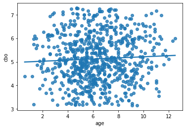

# Relatório

## Autores

**Arthur Rocha Amaral**

**Guilherme Oliveira Antônio**

---

## Introdução

No processo de desenvolvimento de sistemas open-source, em que diversos desenvolvedores contribuem em partes diferentes do código, um dos riscos a serem gerenciados diz respeito à evolução dos seus atributos de qualidade interna. Isto é, ao se adotar uma abordagem colaborativa, corre-se o risco de tornar vulnerável aspectos como modularidade, manutenabilidade, ou legalidade do software produzido. Para tanto, diversas abordagens modernas buscam aperfeiçoar tal processo, através da adoção de práticas relacionadas à revisão de código ou à análise estática através de ferramentas de CI/CD.

Neste contexto, o objetivo deste laboratório é analisar aspectos da qualidade de repositórios desenvolvidos na linguagem Java, correlacionado-os com características do seu processo de desenvolvimento, sob a perspectiva de métricas de produto calculadas através da ferramenta [CK](https://github.com/mauricioaniche/ck).

---

## Metodologia

Para obtermos os dados a serem avaliados, buscamos da API GraphQL do GitHub os repositórios ordenados em ordem decrescente pela quantidade de estrelas da linguagem **java**, listados em páginas de 100 items, assim, pegaremos as 10 primeiras páginas com os dados necessários para respondermos as questões de pesquisa.Após o recebimento dos dados, será filtrado os dados inconsistentes e salvo o resultado em um arquivo CSV. Dessa forma, será feito um clone de cada repositorio java listado e salvo. Com isso, será rodado o projeto de análise de CK, o qual gera os arquivos de analise de metricas. Após esse passo, será construido um aquivos csv com um mescla dos resultados analisado necessários para o trabalho e os dados necessários de cada repositório.

Por fim, após os dados necessários salvos, torna-se viavel a construção dos gráficos construidos com as bibliotecas pandas e seaborn que ilustram os valores obtidos com os quais serão feitos as análises.

---

## Discussão/Hipóteses/Valores obtidos

### RQ Q1 - Qual a relação entre a popularidade dos repositórios e as suas características de qualidade?

***Estrelas x Lcom***

- **Hipótese**:

    Quanto mais popular, melhor é o LCOM dos repositórios, devido a melhor qualidade do código e melhor manutenibilidade e reusabilidade para mais facilitar a distribuição dos esforços entre os colaboradores dos projetos.

- **Resultados**:

    

    
    
Coeficiente de correlação de Spearman para estrelas e lcom r = 0.1580977350487473

    

    Podemos ver, pelo gráfico, uma tendência de aumento do LCOM em relação ao aumento da quantidade de estrelas, mas observando o coeficiente de correlação, vemos que essa correlação é frágil, pois temos muitos repositórios com quantidades iguais de estrelas e não existe uma certa definição de quantidade de LCOM para estes projetos.

***Estrelas x CBO***

- **Hipótese**:

    Devido à popularidade do repositórios atrair mais colaboradores, podemos criar a seguinte hipótese:
    Para que mais pessoas possam atuar no mesmo código, de forma mais eficiente, esperamos que quanto mais popular, menos acoplado seja o código deste.

- **Resultados**:

    

    
    
Coeficiente de correlação de Spearman para estrelas e cbo r = 0.01114985741684774

    

    Como resultado, obtemos uma relação insignificante entre esses dois aspectos, mesmo tendo os 5 primeiros repositórios com mais estrelas, com CBO abaixo da média.

***Estrelas x DIT***

- **Hipótese**:

    Quanto mais popular e colaborativo, o repositório deve ser menos complexo para que mais pessoas possam contribuir com mais facilidade.

- **Resultados**:

    

    
    
Coeficiente de correlação de Spearman para estrelas e dit r = -0.010310920299837729

    

    Apesar do gráfico exibir uma reta decrescente, assim como na analise anterior com o COB, não podemos afirmar que esse grafico ilustra um correlação direta entre os eixo, mesmo mostrando os 5 repositórios mais populares abaixo da média de DTI. O coeficiente de correlação tbm aponta a desconexão dos dados apresentados.

### RQ Q2 - Qual a relação entre a maturidade do repositórios e as suas características de qualidade ?

***Idade x Lcom***

- **Hipótese**:
- **Resultados**:

    

    
    
Coeficiente de correlação de Spearman para estrelas e dit r = 0.05665888721051483

    

***Idade x CBO***

- **Hipótese**:
- **Resultados**:

    

    
    
Coeficiente de correlação de Spearman para age and cbo r = 0.04701408861603262

    

    
***Idade x DIT***

- **Hipótese**:
- **Resultados**:

    

    
    
Coeficiente de correlação de Spearman para age and dti r = 0.19844914547241582

    

### RQ Q3 - Qual a relação entre a atividade dos repositórios e as suas características de qualidade?  

***Releases x Lcom***

- **Hipótese**:
- **Resultados**:

    

    
    
Coeficiente de correlação de Spearman para releases and lcom r = 0.29488717154797317

    

***Releases x CBO***

- **Hipótese**:
- **Resultados**:

    

    
    
Coeficiente de correlação de Spearman para releases and cbo r = 0.23914772455719774

    

    
***Releases x DIT***

- **Hipótese**:
- **Resultados**:

    

    
    
Coeficiente de correlação de Spearman para releases and dit r = 0.09810236267773546

    

### RQ Q4 - Qual a relação entre o tamanho dos repositórios e as suas características de qualidade?  

***LOC x Lcom***

- **Hipótese**:
- **Resultados**:

    

    
    
Coeficiente de correlação de Spearman para loc and lcom r = 0.9463379680074533

    

***LOC x CBO***

- **Hipótese**:
- **Resultados**:

    

    
    
Coeficiente de correlação de Spearman para loc and cbo r = 0.3074195157748057

    

    
***LOC x DIT***

- **Hipótese**:
- **Resultados**:

    

    
    
Coeficiente de correlação de Spearman para loc and dit r = 0.2116342579005864

    
