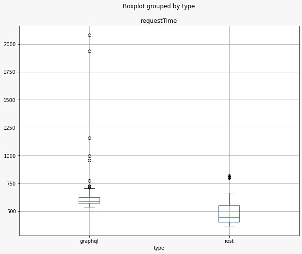
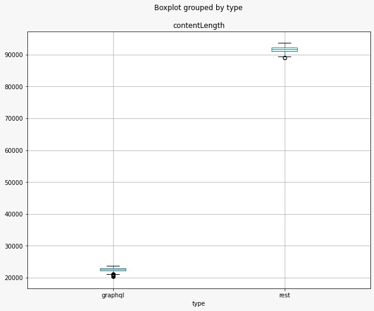

# LAB 05 - Sprint 03

## Autores

**Arthur Rocha Amaral**

**Guilherme Oliveira Antônio**

---

## Introdução

A linguagem de consulta GraphQL, proposta pelo Facebook como metodologia de implementação de APIs Web, representa uma alternativa às populares APIs REST. Baseada em grafos, a linguagem permite que usuários consultem banco de dados na forma de schemas, de modo que se possa exportar a base e realizar consultas num formato definido pelo fornecedor da API. Por outro lado, APIs criados com base em abordagens REST baseiam-se em endpoints: operações pré-definidas que podem ser chamadas por clientes que desejam consultar, deletar, atualizar ou escrever um dado na base. Desde o seu surgimento, vários sistemas realizaram a migração entre ambas as soluções, mantendo soluções compatíveis REST, mas oferecendo os benefícios da nova linguagem de consulta proposta. Entretanto, não está claro quais os reais benefícios da adoção de uma API QraphQL em detrimento de uma API REST. Nesse contexto, o objetivo deste laboratório é realizar um experimento controlado para avaliar quantitativamente os benefícios da adoção de uma API GraphQL.

---

## Objetivo

O objetivo do experimento é utilizar as _APIs_ do _GitHub_ em _GraphQl_ e _REST_, com o intuito de testar performance para consulta de objetos em lista, como por exemplo buscar todos as _stargazers_ de um repositório. Dessa forma, se faz necessário chamadas recursivas, a fim de obter dados agrupados em uma única execução.

---

## Perguntas

RQ1. Respostas à consultas GraphQL são mais rápidas que respostas à consultas REST?

RQ2. Respostas à consultas GraphQL tem tamanho menor que respostas à consultas REST?

---

## Desenho do Experimento

### Métricas

- Tempo médio de cada requisição do processo recursivo;
- Tempo total para alcançar o ponto final (reposta da última requisição com _stargazers_);
- Tamanho médio de cada requisição do processo recursivo;
- Tamanho total recebido para alcançar o ponto final (resposta da última requisição com _stargazers_);

### Hipóteses

Para a nossa pesquisa, basearemos nas hipóteses:

**HIPÓTESE NULA**

A linguagem de consulta GraphQL não se diferencia em termos de performance da REST, mantendo valores similares para o tempo de execução e do tamanho das respostas para consultas recursivas.

**HIPÓTESE ALTERNATIVA**

A linguagem de consulta GraphQL se desempenha melhor em termos de performance em comparação com a REST para consultas que demandam chamadas recursivas, sendo mais eficiente em velocidade de execução e em tamanho das respostas.

### Variáveis Dependentes

- Tempo
- Tamanho

### Variáveis Independentes

- Conexão com a internet
- Proficiência de do usuário executor da consulta
- Interações dos usuários com o repositório buscado

### Tratamentos

GRAPHQL e REST

### Objetos Experimentais

- Análise do tempo e tamanho para a busca de todos os itens da entidade _Stargazers_ do repositório **`elixir-lang/elixir`** no _GitHub_.

### Tipo de Projeto Experimental

_Blocking_

### Quantidade de Medições

Iremos efetuar 194 requisições para buscar um total de 19.373 _stargazers_ em cada API, a partir dessas requisições utilizaremos o dado de cada resposta para ser calculado as métricas propostas.

`Para cada busca à API, o dado de retorno será tratado e armazenado para que tenha uma contagem parcial e temporal de acordo a execução do teste, sendo eles o tempo de execução e o tamanho da resposta incluindo dados do cabeçalho. Porém o tratamento final indicará as métrica de tempo e de tamanho total para alcançar o objetivo final, que é a busca de todos os _Stargazers_ de um repositório.`

### Ameaças à Validade

Pensando nos riscos do experimento, observamos possíveis ameaças à validade de construção e à validade externa:

- **Validade de construção**:

  Pensando que possa ser desenvolvido um experimento com viés, projetando a execução do projeto já antecipando o futuro resultado, devemos validar com mais clareza a montagens dos objetos resultantes das requisições para que os tamanhos das chamadas tenham relevância na comparação, deixando a observação e análise mais justa.

- **Validade externa**:

  Exceções gerados em tempo de execução do experimento, pode causar incongruência nas métricas coletadas, devido à algum fator externo e irreversível, para isso cabe uma tratamento de execução do algoritmo, para que tal não seja afetado ou no mínimo notificando que tal ação deva ser invalidada para que não inviabilize as métricas coletadas.

---

## Metologia

Para se obter os dados que serão avaliados, foi buscado da API GraphQL e na API Rest do GitHub no repositorio **`elixir-lang/elixir`** todos os usuário que deram estrelas. Dessa forma, forma para consolidar nossa hipotese foram pegos da requisição o *Content-lenght*(que é o tamanho do corpo da resposta em bytes) e o tempo de inicio ao o fim da requisição, os quais foram salvos em um arquivo csv. Com esses, dados será gerado as metricas para comparação e diferenciação das perguntas feitas. Além disso, sera criado graficos em escala logaritmica como os dados salvos para a melhor visualização e comparação das Apis GraphQl e Rest.

---

## Resultados Obtidos

### RQ1. Respostas à consultas GraphQL são mais rápidas que respostas à consultas REST?

| Tipo da API | Mediana em milissegundos |
| ----------- | ------------------------ |
| graphql     | 593                      |
| rest        | 448                      |

Como pode ser visto no *blox plot* o rest está sendo mais rapido que o GraphQl, com o valor mediano em milissegundos de 448 em Rest e 558 em GraphQl. Dessa forma, para o melhor entendimento do motivo desse comportamento, foi necessario entender o funcionamento do GraphQl onde para cada requisição e necessario processamento para buscar apenas as propriedades solicitadas. Esse pode ser o motivo do tempo em GraphQl ser maior que o tempo em Rest.

### RQ2. Respostas à consultas GraphQL tem tamanho menor que respostas à consultas REST?

| Tipo da API | Mediana em Bytes |
| ----------- | ---------------- |
| graphql     | 22678            |
| rest        | 91649            |

As resposta da consulta de GraphQl são menores que as de rest com os valor mediano em bytes de 22678 bytes para GraphQl e de 91649 para Rest. Isso acontece, pois no GraphQl as propriedades que vem no corpo da requisição são apenas aquelas que são solicitadas, desse modo o tamanho da requisição se torna menor em relação a Rest, a qual tras no corpo da requisição todos os dados definidos para um *end point*. 

---

## Discussão

Como pode ser observado na seção anterior, os dados requisitados na API REST são de certa forma mais pesados, pois eles trazem o conteúdo textual maior com as referencias para os endpoints da API onde se encontram demais atributos do objeto solicitado, como por exemplo ao buscar um usuário, na resposta vem tambem a referencia para o endpoint de repositorios que tem um relacionamento de um para muitos com o usuário, por isso exige outro endpoint para buscar a lista de repositórios daquele usuário, gerando então uma sobrecarga das requisições com dados que não fazem parte diretamente da entidade solicitada.

Sobretudo, mesmo com os dados da API GraphQL sendo mais objetivos, o tempo gasto por esta tecnologia é maior devido ao esforço computacional exigido para encontrar os itens em questão, sendo assim podemos concluir que mesmo que a API REST traga dados "desnecessários", o tempo gasto para retorna-los ao usuário é bem menor devido a facilidade de encontrar tais dados nas bases, tornando também a consulta de dados com poucos níveis mais fáceis.
